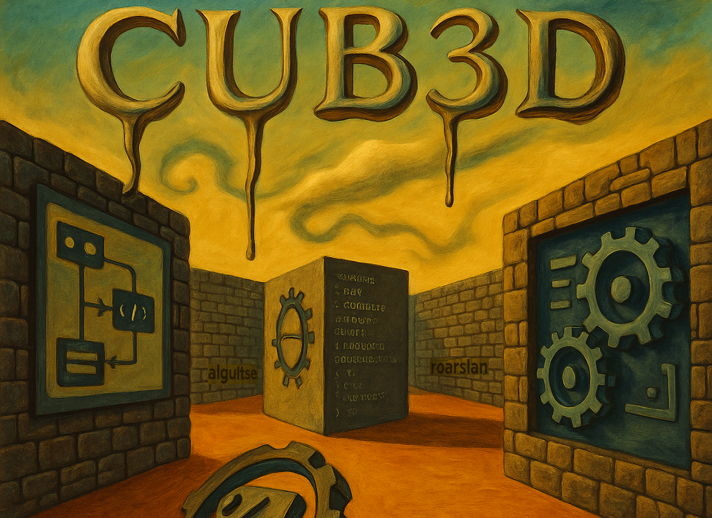
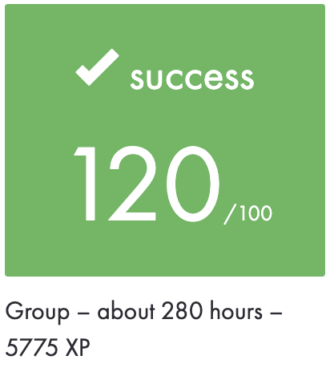
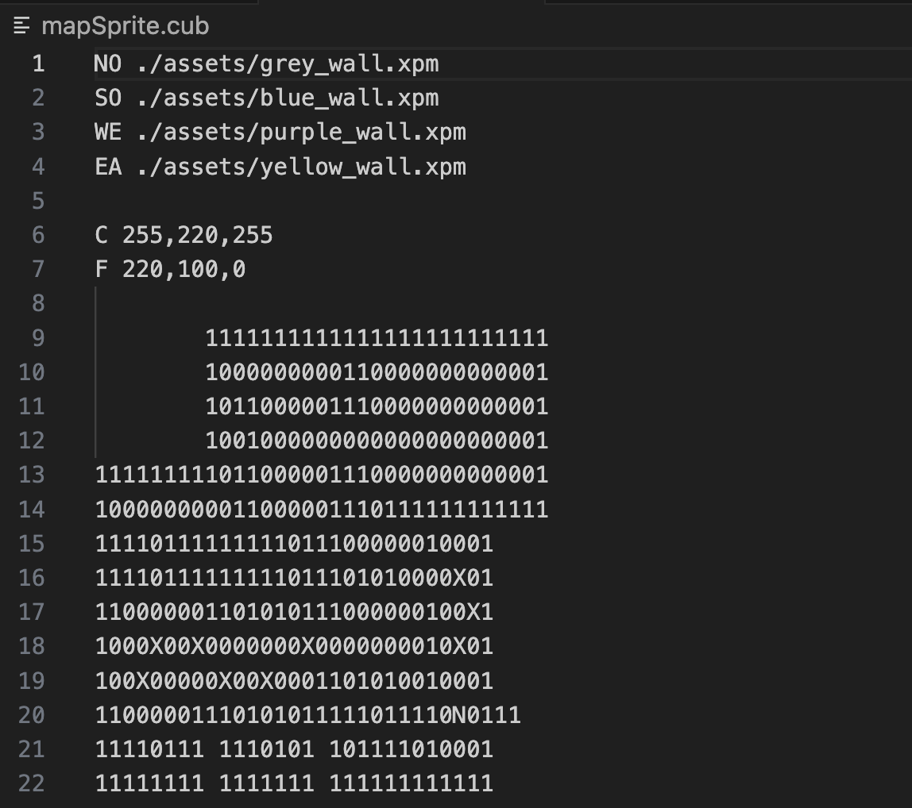
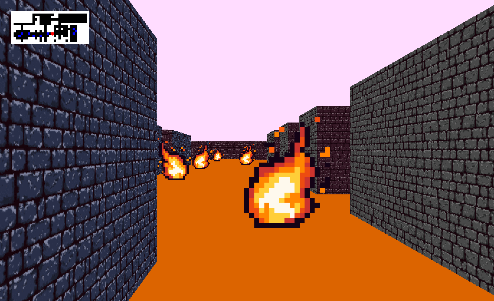

|          Grade           |                           |
|:------------------------:|:-------------------------:|
|  |  |

<br>

---

<details>
<summary>🇫🇷 FRENCH VERSION</summary>

<p align="center">
	Ceci est un <a href="./subject/Cub3D.fr.subject.pdf">projet</a> réalisé à l’école 42 en novembre 2024.
</p>

## Description
Il s’agit de créer un moteur de rendu en **raycasting**, permettant de naviguer dans un environnement pseudo-3D à partir d’une `carte 2D`.

Le projet met l’accent sur le rendu graphique avec MiniLibX, le parsing de fichiers, la gestion des textures, des sprites, des collisions, et des événements clavier/souris.

## Compétences:
- `Implémentation d’un moteur` de raycasting
- Maîtrise des mathématiques `2D/3D` (vecteurs, angles, projections)
- Parsing robuste de fichiers de configuration `.cub`
- Utilisation avancée de `MiniLibX`
- Gestion des `textures`, `couleurs`, `collisions`, `mini-carte`
- `Événements utilisateur` : clavier & souris
- Optimisation mémoire et performances
- Travail en **binôme**

## Installation
```bash
git clone https://github.com/N0fish/Cub3D.git
cd cub3D
```

## Exécution
### mandatory
```bash
make
./cub3D map.cub
```

### bonus
```bash
make bonus
./cub3D mapSprite.cub
```

flags valgrind
```bash
valgrind --track-fds=yes --trace-children=yes --leak-check=full --show-leak-kinds=all ./cub3D name.cub
```

</details>

---

<details>
<summary>🇬🇧 ENGLISH VERSION</summary>

<p align="center">
    This is a <a href="./subject/Cub3D.en.subject.pdf">project</a> from 42 School, completed in November 2024.
</p>

## Description
It aims to simulate a pseudo-3D world from a `2D map`, using the C language and MiniLibX graphical library.

The project includes features such as map parsing, texturing, collision detection, animated sprites, and event handling.

## Skills:
- `Raycasting engine` implementation
- Applied math in `2D/3D` (vectors, angles, projections)
- File parsing `.cub` and error handling
- Real-time rendering with `MiniLibX`
- `Texture` and `sprite` handling, `collision` system and `mini-map`
- Keyboard and mouse `input handling`
- Memory management and optimization
- **Teamwork**

## Installation
```bash
git clone https://github.com/N0fish/Cub3D.git
cd cub3D
```

## Exécution
### mandatory
```bash
make
./cub3D map.cub
```

### bonus
```bash
make bonus
./cub3D mapSprite.cub
```

flags valgrind
```bash
valgrind --track-fds=yes --trace-children=yes --leak-check=full --show-leak-kinds=all ./cub3D name.cub
```

</details>

---

<details>
<summary>🇷🇺 RUSSIAN VERSION</summary>

<p align="center">
    Это <a href="./subject/Cub3D.en.subject.pdf">проект</a> из школы 42, выполненный в ноябре 2024 года.
</p>

## Описание
Цель — создать 3D-движок на основе техники **raycasting**, позволяющий игроку перемещаться по лабиринту, представленному как `2D-карта`, в режиме от первого лица.

Проект включает в себя парсинг карты, рендеринг с текстурами, обработку коллизий, анимированные спрайты, и ввод с клавиатуры и мыши.

## Навыки:
- `Реализация движка` raycasting
- Применение математики `2D/3D` (углы, векторы, проекции)
- Разбор файлов `.cub` и проверка на ошибки
- Графический вывод через `MiniLibX`
- Работа с `текстурами`, `спрайтами`, `коллизиями` и `mini-картой`
- `Управление вводом` (клавиши, мышь)
- Оптимизация и управление памятью
- Работа в **команде**

## Установка
```bash
git clone https://github.com/N0fish/Cub3D.git
cd cub3D
```

## Запуск
### обязательная
```bash
make
./cub3D map.cub
```

### бонусная
```bash
make bonus
./cub3D mapSprite.cub
```

флаги valgrind
```bash
valgrind --track-fds=yes --trace-children=yes --leak-check=full --show-leak-kinds=all ./cub3D name.cub
```

</details>

---

<br>

## Cub3D rendered output

The project is a raycasting engine inspired by the legendary game **Wolfenstein 3D**, considered the first FPS in video game history.

|           Bonus              |                                   |
|:----------------------------:|:---------------------------------:|
|  |  |